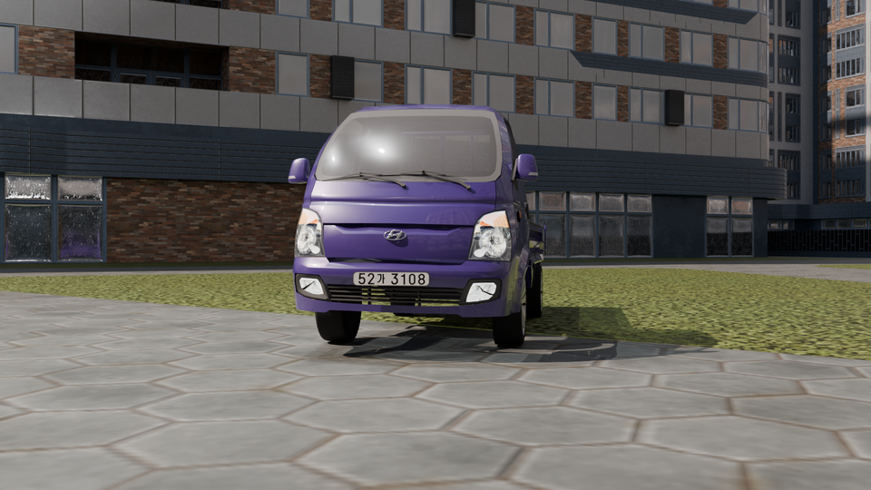
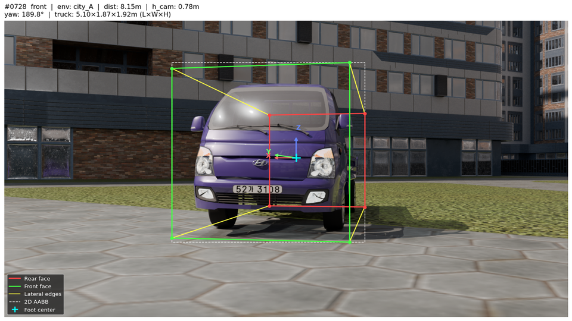

# TruckDetection

Monocular 3D Bounding Box Estimation for trucks using Blender-generated synthetic data and a SMOKE/CenterNet-style ablation study.

---

## Overview

This project investigates how much geometric prior knowledge helps monocular 3D object detection. A synthetic dataset of truck scenes is generated via Blender, and four model variants are trained and compared to isolate the contribution of each component.

**Key idea**: Can we replace learned depth prediction with a simple geometric formula `Z = fy · h_cam / (v_c − cy)` by exploiting known camera height?

---

## Dataset

Synthetic data generated with Blender using a Hyundai Porter truck 3D model placed across diverse urban scenes (HDRI backgrounds, randomized pose, lighting, and camera parameters).

| Split | Samples |
|-------|---------|
| Train | 4,000   |
| Val   | 1,000   |
| Total | 5,000   |

### Sample

| Raw Image | Label Visualization |
|:---------:|:-------------------:|
|  |  |

> Sample #0728 — environment: city\_A, distance: 8.15 m, truck: 5.10×1.87×1.92 m (L×W×H)
>
> Visualization: rear face (red), front face (green), lateral edges (yellow), 2D AABB (white dashed), foot center (cyan +), orientation axes (X/Y/Z)

Each sample includes:
- RGB image (1920×1080, letterboxed to 640×640 during training)
- Depth map (1920×1080, float32, meters)
- Camera intrinsics `K`
- 3D bounding box corners (world + camera coords)
- Yaw angle, camera height `h_cam`

Depth statistics (training split): mean = 6.15 m, std = 2.48 m, range = [2.0, 12.8 m]

> Dataset not included in this repo (large files). Generation script: `generate_synthetic_dataset.py`

---

## Model Variants (Ablation Study)

All models share a **ResNet-34 backbone** (stride-8, 80×80 feature map) following the SMOKE/CenterNet architecture with **GroupNorm(32)** in all detection heads.

| Model | Predicts | Z source | W/H/L source |
|-------|----------|----------|--------------|
| `baseline` | heatmap + offset + Z/W/H/L/yaw | Learned (µ + δ·σ) | Learned (exp-scaled) |
| `geometry` | heatmap + offset + yaw | Formula: `fy·h_cam/(v_c−cy)` | Fixed prior |
| `baseline_depth` | baseline + dense depth map | Learned | Learned |
| `geometry_aux` | geometry + dense depth map | Formula | Fixed prior |

The `geometry` variants use the ground-plane constraint: since the foot center of the truck is always at ground level (`Y_cam = h_cam`), depth can be recovered analytically from the 2D projection.

Baseline depth encoding uses dataset statistics: `Z = µ_z + δ · σ_z` (µ=6.15 m, σ=2.48 m), providing better gradient scaling than unconstrained softplus.

---

## Training

Follows the **SMOKE paper** training configuration:

- Optimizer: Adam (no weight decay)
- Learning rate: 2.5e-4
- Scheduler: MultiStepLR at **42%** and **67%** of total epochs, γ=0.1
- Epochs: 200
- Batch size: 32
- Gradient clipping: max\_norm=10.0
- 5 random seeds: [42, 0, 1, 2, 3]

### Loss Functions

The 3D corner loss follows the **SMOKE disentangled loss** formulation:

| Component | Type | Description |
|-----------|------|-------------|
| `L_heat` | Modified Focal Loss (α=2, β=4) | Heatmap; GT built with adaptive Gaussian radius (CenterNet IoU formula) |
| `L_off` | L1 | Sub-pixel offset at GT location |
| `L_orient` | L1 | GT location+dims + predicted αz→θ |
| `L_dim` | L1 | GT location+θ + predicted W/H/L (baseline only) |
| `L_loc` | L1 | GT θ+dims + predicted location |
| `L_depth` | Masked L1 | Dense depth (aux models only, λ=0.1) |

Yaw is encoded as **observation angle αz** (`αz = θ − arctan(x/z)`), which is more view-invariant than the global yaw angle. At inference: `θ = αz + arctan(X/Z)`.

> Heatmap GT center = foot center (`gt_corners_2d[[0,1,4,5]].mean`), not the geometric center. This is required for the Z formula to be exact.

### Evaluation Metrics

| Metric | Description |
|--------|-------------|
| `Z` (m) | MAE of predicted vs GT depth |
| `ADD-S` (m) | Symmetric Average Distance (nearest-neighbor corner matching) |
| `hm_max` | Peak value of predicted heatmap; should approach 1.0 early in training |
| `grad` | Global gradient norm before clipping |

---

## Usage

```bash
# Install dependencies
pip install torch torchvision pillow matplotlib numpy

# Generate dataset (requires Blender 5.0+)
blender --background --python generate_synthetic_dataset.py

# Re-render any missing samples
blender --background --python regen_missing.py

# Run full ablation study (4 models × 5 seeds, 200 epochs)
python -m train.ablation_study --epochs 200 --batch 32
```

### Official SMOKE Baseline (Paper Code)

The official SMOKE repository is cloned under `external/SMOKE` and can be used
as the baseline reference implementation from the paper.

```bash
# 1) Build official SMOKE extensions once (inside cloned repo)
cd external/SMOKE
python setup.py build develop

# 2) Launch official baseline training from this project root
cd /path/to/TruckDetection
python -m train.run_official_smoke_baseline --config-file configs/smoke_gn_vector.yaml
```

You can also pass config overrides through the launcher:

```bash
python -m train.run_official_smoke_baseline \
  --config-file configs/smoke_gn_vector.yaml \
  SOLVER.MAX_ITERATION 5000 SOLVER.IMS_PER_BATCH 8
```

Results are saved to `results/ablation_study/seed_{s}/{model}/`:

- `best.pt` — best checkpoint (lowest val loss)
- `last.pt` — final checkpoint
- `history.json` — per-epoch loss and metrics

---

## Project Structure

```
.
├── generate_synthetic_dataset.py   # Blender synthetic data generation
├── regen_missing.py                # Re-render missing samples by index
├── train/
│   ├── models.py                   # 4 model architectures (GroupNorm heads)
│   ├── smoke_loss.py               # Focal loss + disentangled 3D corner loss
│   ├── ablation_study.py           # Multi-seed ablation runner
│   ├── smoke_trainer.py            # Single-run training loop
│   ├── metrics.py                  # Z-Error, ADD-S
│   └── dataset.py                  # DataLoader
├── datasets/
│   └── v3/
│       ├── images/                 # RGB images (640×640)
│       ├── depth/                  # Depth maps (.npy + .png)
│       ├── labels/                 # JSON labels per sample
│       └── split.json              # Train/val split (seed=42)
├── results/
│   └── ablation_study/
│       └── seed_{s}/{model}/
│           ├── best.pt
│           └── history.json
└── hyundai-porter-truck/           # 3D truck model assets
```

---

## Requirements

- Python 3.10+
- PyTorch 2.x (MPS or CUDA)
- Blender 5.0+ (dataset generation only)

```bash
pip install torch torchvision pillow matplotlib numpy
```
